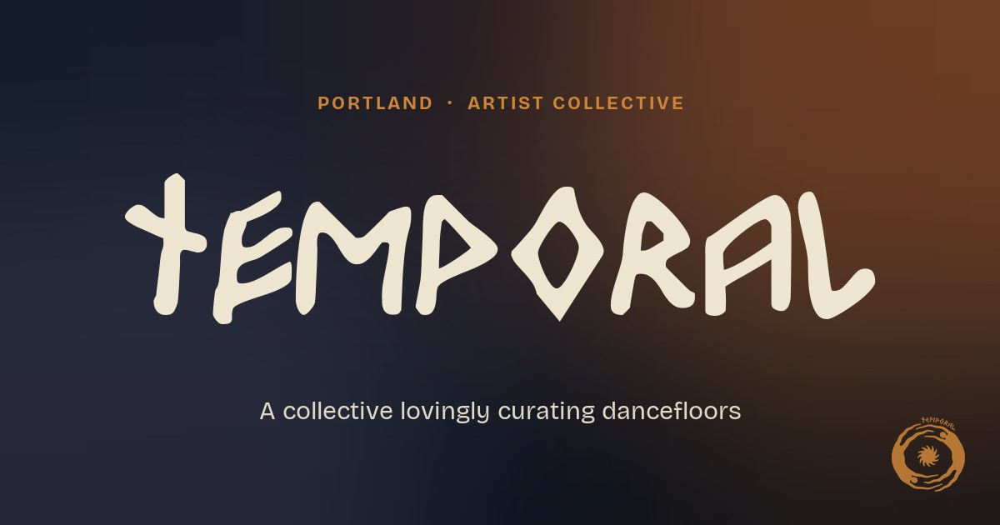
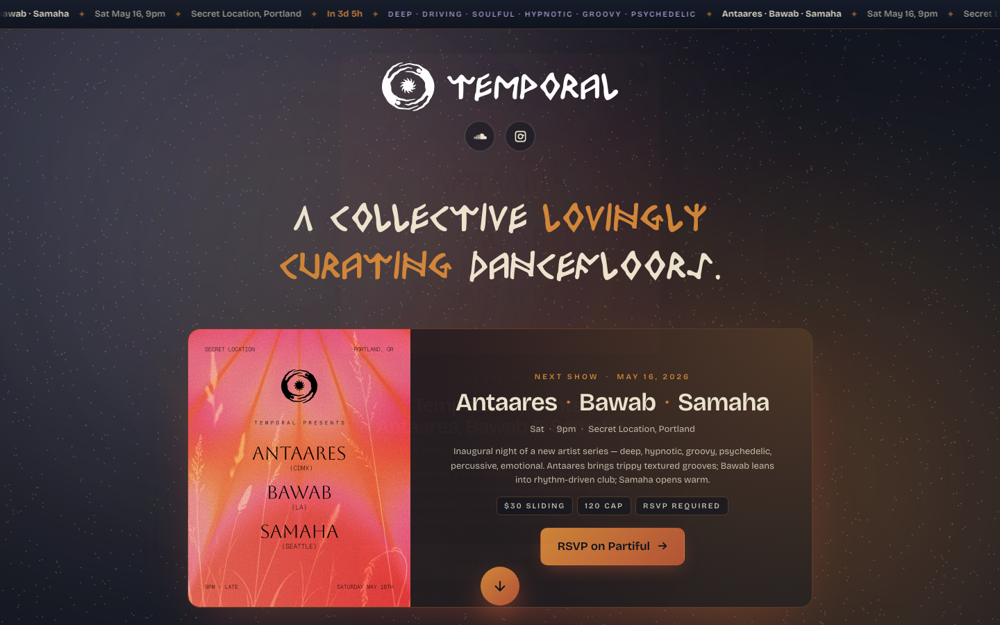

<p align="center">
  
</p>

<h1 align="center">Temporal</h1>

<p align="center"><i>A collective lovingly curating dancefloors.</i></p>

<p align="center">
  <a href="https://www.temporal-sound.com">temporal-sound.com</a>
  ·
  <a href="https://soundcloud.com/temporal-sound">SoundCloud</a>
  ·
  <a href="https://www.instagram.com/temporal.sound">Instagram</a>
</p>

---

Landing page for **Temporal** — a Portland-based artist collective curating deep, hypnotic, groovy, psychedelic dancefloors. Hand-built, no framework.



## Stack

- Vanilla HTML / CSS / JavaScript — no framework, no build step
- Self-hosted display + body fonts
- Deployed on **GitHub Pages** with `temporal-sound.com` as a custom domain (see [`CNAME`](CNAME))
- RSVP / join form posts to a **Google Apps Script** Web App

## Local development

```bash
python3 -m http.server 8000
# → http://localhost:8000/
```

## Image optimization

Drop originals into `img_src/`, then:

```bash
magick mogrify -path img -format jpg \
  -auto-orient -resize '2048x2048>' -strip \
  -sampling-factor 4:2:0 -interlace JPEG -quality 82 -colorspace sRGB \
  img_src/*
```

## Layout

```
index.html         Homepage
styles.css         Design tokens + all styles
script.js          Ticker, modal, FAB, RSVP form

brand/             Logo marks + brand guideline
icons/             SVG icons
fonts/             Self-hosted display + body fonts
img/               Optimized photo assets + OG image

sonido/            /sonido/ archive (Sonido series)
caleesi/           /caleesi/ archive (Caleesi × Kreis)
events/            /events/ archive (all past shows)
```
